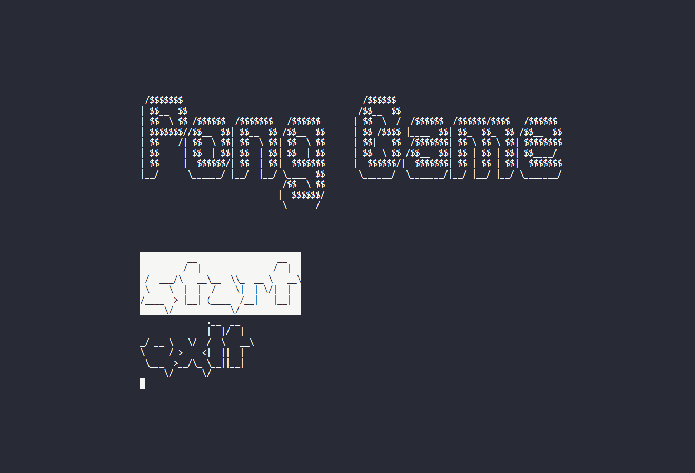
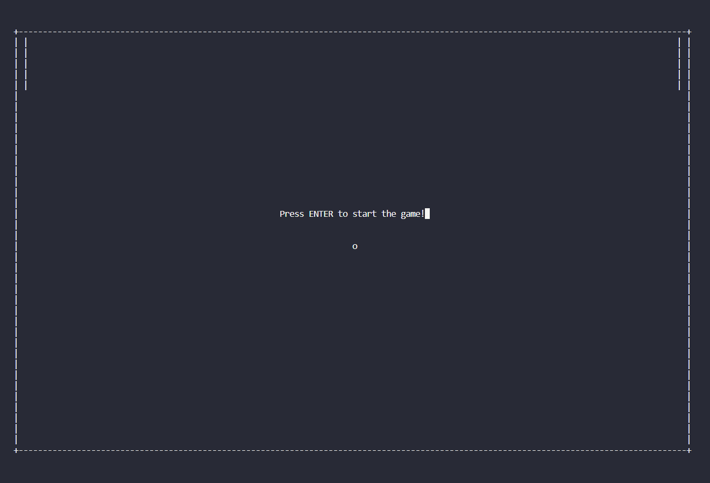
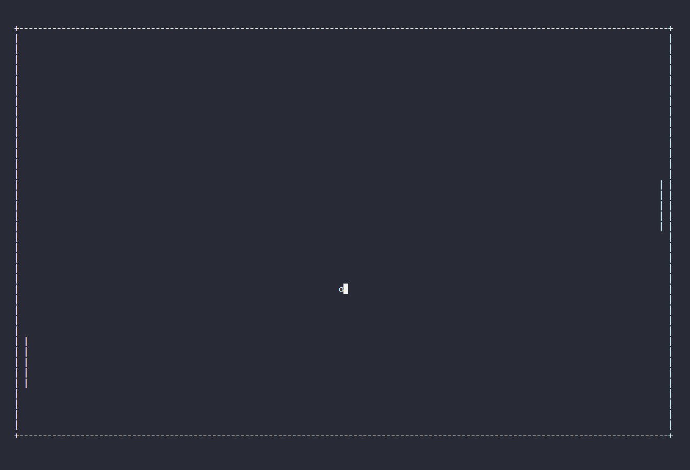
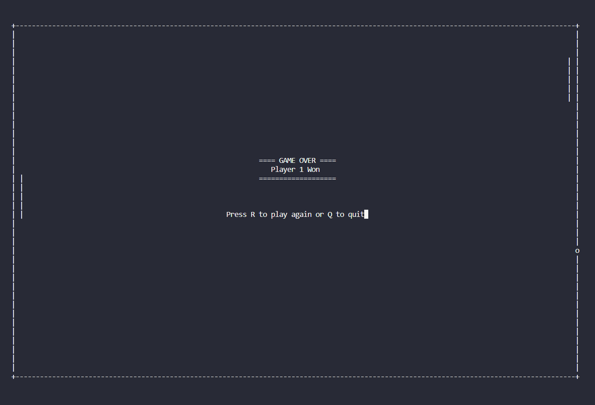

# [Pong Game](https://github.com/GustavoZiel/Pong-Game)

Developed by:

- Gustavo Gabriel Ribeiro - 13672683
- Artur De Vlieger Lima - 13671574
- João Pedro Soares de Azevedo Calixto - 13732011
- Lucas de Souza Brandão - 13695021

## How to Install

The game was entirely developed in C, without using any resources from other languages. It uses the following libraries:

```c
#include <stdio.h>
#include <stdlib.h>
#include <string.h>
#include <time.h>
#include <unistd.h>
#include <pthread.h>
#include <ncurses.h>
```

All of these libraries, except for **ncurses**, are already included in native C.

The **ncurses** library was used to develop the game's graphical interface. See its [usage guide](https://tldp.org/HOWTO/NCURSES-Programming-HOWTO/) for more information.

### How to Install ncurses

> It is recommended to try running the program (as explained in the **How to Run** section) to check if **ncurses** is already installed. A terminal message along with instructions for installing it, specific to your system, should appear if it is not. You can also proceed with the following commands:

On Debian-based systems (like Ubuntu):

```sh
sudo apt-get install libncurses5-dev libncursesw5-dev
```

On Red Hat-based systems (like Fedora):

```sh
sudo dnf install ncurses-devel
```

## How to Run

To run the game, execute the following instructions:

```sh
make all # Compile files and generate executable
make run # Run the game
or
make all run
```

If any changes are made to the game files, such as changing the difficulty or arena size (mentioned in the **How to Customize** section), the program needs to be recompiled.

```sh
make clean # Delete generated files
make all run # Recompile and run
or 
make clean all run
```

## How to Play

**Menu** is controlled by the **arrow keys**: <kbd>↑</kbd> <kbd>↓</kbd> <br>
**Player 1** controls the left paddle with <kbd>w</kbd> <kbd>s</kbd> <br>
**Player 2** controls the right paddle with <kbd>↑</kbd> <kbd>↓</kbd> 

**No more, play PONG!!!**

## How to Customize

You can change the game's difficulty by uncommenting and commenting the necessary parts in the **menu.h** file.
<br><br>
You can create custom configurations by altering the definitions: **SPEED TAM_X TAM_Y TAM_RAQUETE** as you wish, but be aware of the values provided, as inconsistencies can cause bugs.

## Descriptions of Semaphores and Threads Used

### Threads

In total, **three threads** were implemented to improve the game's efficiency and responsiveness.

Two of these threads are dedicated to controlling the paddles, one for player 1's paddle and the other for player 2's paddle. The third thread is responsible for the ball's movement.

The reason for this approach is that the operations involving the paddles and the ball are independent of each other and can occur simultaneously, thus optimizing the game's performance.

Code developed in **logic.c**:

```c
pthread_t p, q, r;
pthread_create(&p, NULL, move_raquete_wrapper, (void *)(setup->jogadores[0]));
pthread_create(&q, NULL, move_raquete_wrapper, (void *)(setup->jogadores[1]));
pthread_create(&r, NULL, move_ball_wrapper, (void *)(setup));
```

### Semaphores

Semaphores were used to control the screen update action. That is, after any of the 3 objects in the game - first paddle, second paddle, and ball - move, the screen needs to be updated so that the movement is perceived by the players.

This action is performed by the following function present in the ncurses library:

```c++
wrefresh(window);
```

After incorporating mutexes, the code looks like this:

```c++
pthread_mutex_lock(&mutex);
wrefresh(window);
pthread_mutex_unlock(&mutex);
```

This way, race conditions, which could cause interface glitches, are mitigated by using semaphores.

## Game Images

### Menu



### Start



### Play



### End

